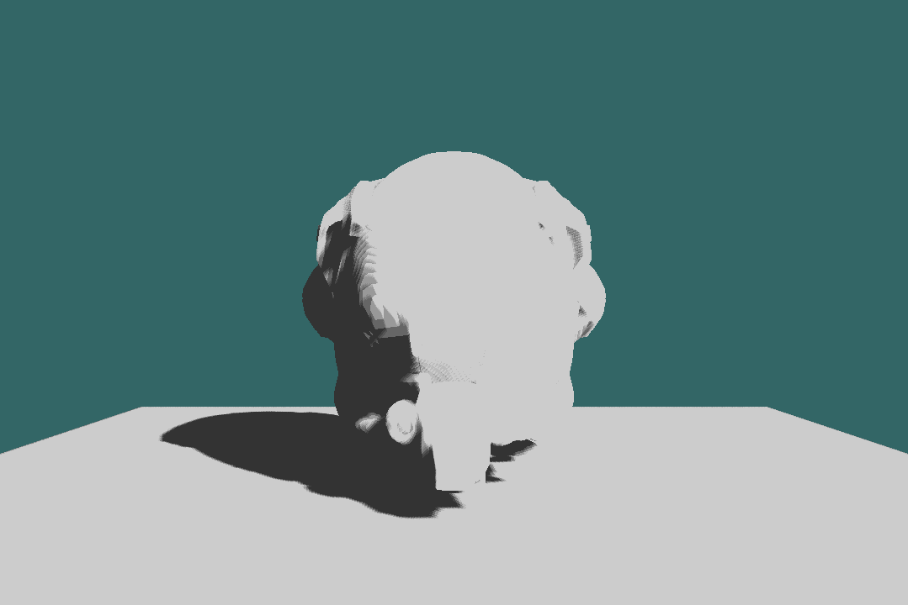
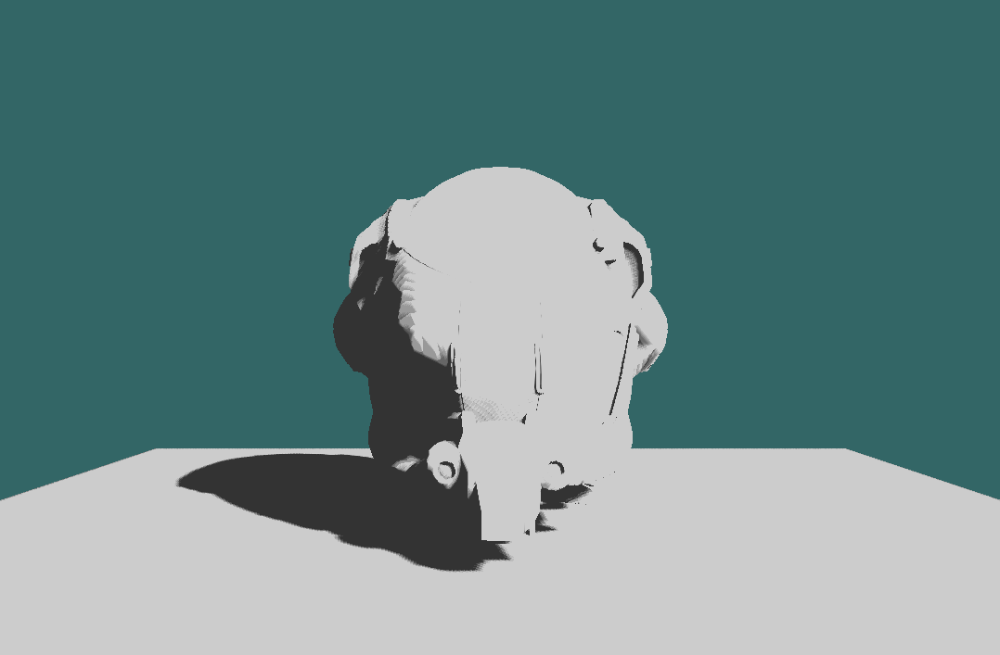

# RunAwayAndUseMetal
https://vulkan-tutorial.com/Introduction

```
git submodule update --init --recursive
cd vcpkg
.\bootstrap-vcpkg.bat
```
using Visual Studio or Clion open this folder direclty, IDEs take care of the next step.
For Clion, you may need to choose cmake preset manually at first launch.
For the first time, you may need to set `VCPKG_MANIFEST_INSTALL` to "ON" in `CMakePresets.json` to properly prepare the built-essentials.


### Most recent work:
#### pcf shadow map 


#### with contact shadow


### What is going on:
1. Seperate rendering thread for Editor(Human :,)
2. Bistro
3. SSAO - GTAO
4. Soft shadow

TODO:
 - [ ] InputSystem
 - [ ] std::container -> pmr
 - [ ] ECS
 - [ ] Mesh Shader
 - [ ] RayTracing pass
 - [ ] Multi Device Queue
 - [ ] too long to write down

