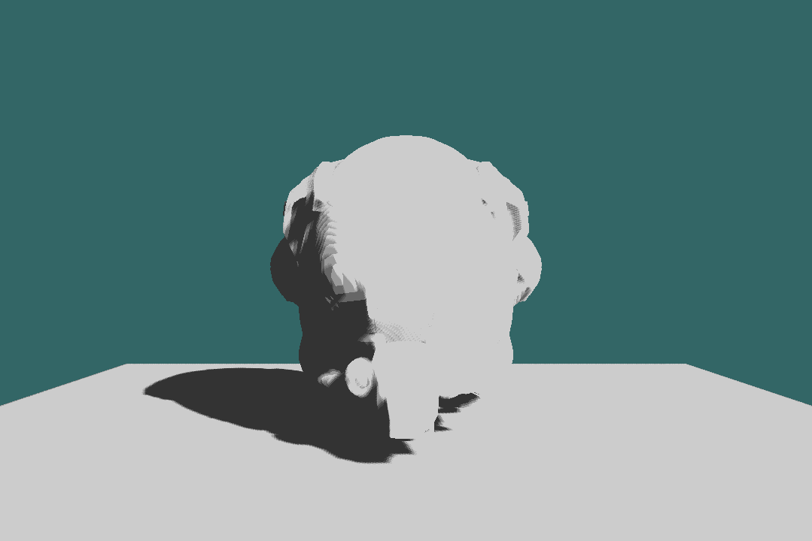
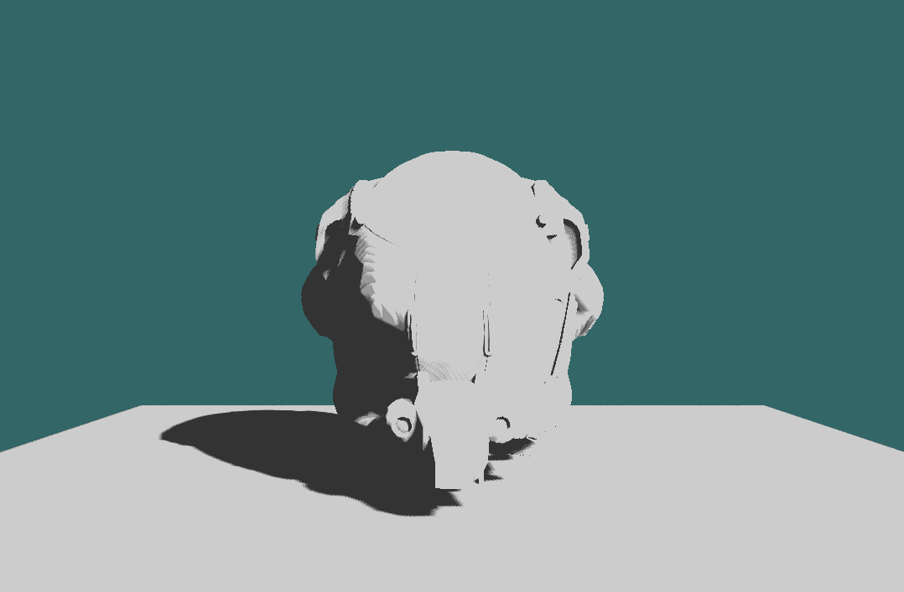

# RunAwayAndUseMetal
https://vulkan-tutorial.com/Introduction

Prerequisites: CMake 3.24+, Ninja, LLVM, the Vulkan SDK, and Git.

```powershell
git submodule update --init --recursive
cd vcpkg
.\bootstrap-vcpkg.bat
cd ..
```

The project uses CMake Presets as its single build entry point. The shared
presets use Ninja and LLVM; Visual Studio and CLion can both open the folder
and select the same preset.

```powershell
cmake --preset debug
cmake --build --preset debug
ctest --preset debug
.\build\debug\raum_sample.exe
```

Use the `release` preset for optimized builds. CMake installs manifest
dependencies into the shared `vcpkg_installed` directory automatically.


### Most recent work:
#### pcf shadow map 


#### with contact shadow


### What is going on:
- raytracing pass

TODO:
 - [ ] InputSystem
 - [ ] std::container -> pmr
 - [ ] ECS
 - [ ] Mesh Shader
 - [ ] RayTracing pass
 - [ ] Multi Device Queue
 - [ ] too long to write down

